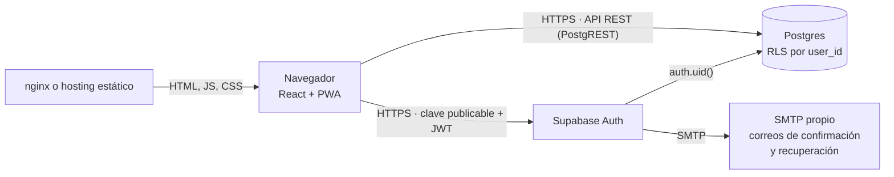

# Finanzas

Aplicación web de finanzas personales para llevar mes a mes los ingresos, los gastos fijos, los gastos variables y el ahorro. Cada persona tiene su propia cuenta y sus datos quedan aislados del resto mediante Row Level Security en Postgres.

Es una aplicación estática (PWA instalable) construida con React y TypeScript que se conecta directamente a [Supabase](https://supabase.com) para la autenticación y la base de datos. No requiere un servidor propio. Los montos se manejan en pesos chilenos (CLP, sin decimales).

## Tabla de contenidos

- [Funcionalidades](#funcionalidades)
- [Stack tecnológico](#stack-tecnológico)
- [Arquitectura](#arquitectura)
- [Seguridad](#seguridad)
- [Requisitos](#requisitos)
- [Puesta en marcha](#puesta-en-marcha)
- [Desarrollo local](#desarrollo-local)
- [Despliegue](#despliegue)
- [Estructura del proyecto](#estructura-del-proyecto)
- [Scripts disponibles](#scripts-disponibles)
- [Licencia](#licencia)
- [Autor](#autor)

## Funcionalidades

- **Cuentas de usuario**: registro con confirmación por correo, inicio de sesión y recuperación de contraseña. Cada usuario nuevo parte con un conjunto de categorías listas para usar.
- **Resumen del mes**: cuánto queda disponible, cuánto falta por pagar y la variación respecto al mes anterior, con navegación entre meses.
- **Gastos fijos como cuentas por pagar**: cada categoría fija con monto mensual (arriendo, luz, internet, etc.) aparece cada mes con una casilla para marcarla como pagada. Si la cuenta llega por otro monto, se ajusta al pagar.
- **Gastos variables**: ingreso rápido (descripción, monto y Enter), agrupados por día, con aviso de **gastos hormiga** (compras de hasta $5.000).
- **Categorías y presupuestos**: alta, edición y eliminación de categorías por tipo, con presupuesto mensual por categoría y aviso cuando está por agotarse o se excede.
- **Movimientos recurrentes**: los ingresos y ahorros marcados como recurrentes del mes anterior se pueden copiar al mes actual con un clic, sin duplicados.
- **Movimientos**: listado con búsqueda y filtros, edición, y **exportación / importación en CSV** (compatible con Excel, sin duplicar filas ya importadas).
- **Histórico**: gráfico de ingresos frente a gastos y ahorro de los últimos 6, 12 o 24 meses.
- **Usabilidad**: eliminar con opción de **deshacer**, atajo de teclado `N` para registrar un movimiento nuevo y PWA instalable en el escritorio o el teléfono.

## Stack tecnológico

| Capa | Tecnología |
|---|---|
| Interfaz | React 18, TypeScript, React Router 7 |
| Estilos | Tailwind CSS 3, íconos Lucide |
| Gráficos | Recharts (carga diferida, solo en el histórico) |
| Build | Vite 6, vite-plugin-pwa (Workbox) |
| Backend como servicio | Supabase: Auth y Postgres con Row Level Security (`@supabase/supabase-js`) |
| Correo transaccional | SMTP propio configurado en Supabase Auth (por ejemplo, Resend) |
| Despliegue | Sitio estático o contenedor Docker con nginx |
| Gestor de paquetes | pnpm 11 |

## Arquitectura

La aplicación se ejecuta por completo en el navegador. Se comunica con Supabase usando la clave publicable y el token de sesión del usuario; Postgres aplica las políticas RLS en cada consulta.



Modelo de datos:

- `categories`: categorías por usuario y tipo (`income`, `fixed`, `variable`, `savings`). En los gastos fijos, `budget` es el monto mensual de la cuenta; en los variables, el presupuesto.
- `transactions`: movimientos con monto (CLP), tipo, fecha, categoría opcional y marca de recurrente.
- Un trigger sobre `auth.users` crea las categorías iniciales de cada usuario nuevo.

## Seguridad

- **Row Level Security** activado en `categories` y `transactions`: las políticas solo permiten leer, crear, modificar y eliminar las filas cuyo `user_id` coincide con `auth.uid()`.
- **Clave foránea compuesta** `(category_id, user_id, type)`: garantiza que la categoría de un movimiento pertenezca al mismo usuario y sea del mismo tipo. Al eliminar una categoría, los movimientos se conservan sin categoría.
- **Restricciones en la base**: largo de nombres y descripciones, montos positivos y nombres de categoría únicos por usuario y tipo.
- **Clave publicable en el navegador**: es segura de exponer por diseño; lo que protege los datos son las políticas RLS. Ninguna clave secreta (`service_role`, tokens de administración o credenciales SMTP) se incluye en el build: Vite solo expone las variables con prefijo `VITE_`.
- **Función con `security definer`** del trigger de categorías con `search_path` vacío y permisos de ejecución revocados para los roles públicos.
- **Cifrado**: Supabase cifra el tráfico en tránsito (TLS) y los datos en reposo (AES-256).

## Requisitos

- [Node.js](https://nodejs.org) 22.13 o superior
- [pnpm](https://pnpm.io/installation) 11 o superior (el proyecto fija `pnpm@11.5.0` en `packageManager`)
- Un proyecto en [Supabase](https://supabase.com)
- Opcional: un proveedor SMTP (por ejemplo [Resend](https://resend.com)) para el correo y Docker para el despliegue en contenedor

## Puesta en marcha

### 1. Base de datos

En un proyecto de Supabase, crea el esquema de la aplicación:

- Un tipo enumerado `transaction_type` con los valores `income`, `fixed`, `variable` y `savings`.
- La tabla `categories` (`id`, `user_id`, `name`, `type`, `budget`, `created_at`), con `user_id` por defecto `auth.uid()` y una restricción única `(id, user_id, type)`.
- La tabla `transactions` (`id`, `user_id`, `category_id`, `description`, `amount`, `type`, `date`, `recurring`, `created_at`), con la clave foránea compuesta `(category_id, user_id, type)` hacia `categories`.
- Row Level Security activado en ambas tablas, con políticas de `select`, `insert`, `update` y `delete` para el rol `authenticated` limitadas a `auth.uid() = user_id`.
- Opcional: un trigger sobre `auth.users` que cree las categorías iniciales de cada usuario nuevo.

### 2. Autenticación

En **Authentication → URL Configuration**:

- **Site URL**: la URL donde corre la app (en desarrollo, `http://localhost:5173`).
- **Redirect URLs**: agrega `http://localhost:5173/**` y la URL de producción (por ejemplo `https://finanzas.tudominio.cl/**`).

### 3. Correo

El correo por defecto de Supabase solo llega a los miembros del equipo del proyecto y usa un remitente genérico. Para usuarios reales y un remitente propio:

1. Configura un SMTP propio en **Authentication → Emails → SMTP Settings** (por ejemplo, Resend con un dominio verificado).
2. Personaliza las plantillas **Confirm signup** y **Reset password** en **Authentication → Emails → Templates**.

## Desarrollo local

```bash
cp .env.example .env   # completa VITE_SUPABASE_URL y VITE_SUPABASE_PUBLISHABLE_KEY
pnpm install
pnpm run dev
```

La app queda disponible en `http://localhost:5173`. La URL y la clave publicable se obtienen en **Project Settings → API Keys** de Supabase.

Verificación de tipos y build de producción:

```bash
pnpm run typecheck
pnpm run build
pnpm run preview   # sirve el build en http://localhost:5173
```

## Despliegue

La app es un sitio estático: puede publicarse en Vercel, Netlify, Cloudflare Pages o cualquier hosting estático, siempre que todas las rutas respondan con `index.html` (enrutamiento del lado del cliente).

Las variables `VITE_SUPABASE_URL` y `VITE_SUPABASE_PUBLISHABLE_KEY` **se incrustan en el build**, por lo que deben estar definidas al momento de compilar.

### Docker

El `Dockerfile` compila la app con Node 22 y la sirve con nginx (configuración en [`nginx.conf`](nginx.conf), con caché inmutable para los assets y sin caché para el service worker).

```bash
docker compose up -d --build   # lee las variables desde .env
```

La web queda publicada en el puerto definido por `WEB_PORT` (por defecto `3000`). Sin Compose:

```bash
docker build \
  --build-arg VITE_SUPABASE_URL=https://tu-proyecto.supabase.co \
  --build-arg VITE_SUPABASE_PUBLISHABLE_KEY=sb_publishable_xxx \
  -t finanzas .
docker run -d -p 3000:80 finanzas
```

Recuerda agregar la URL de producción en las Redirect URLs de Supabase.

## Estructura del proyecto

```text
.
├── public/                  # Íconos y manifest de la PWA
├── src/
│   ├── components/          # Componentes de interfaz (layout, modales, tarjetas, editor)
│   ├── lib/                 # Cliente Supabase, auth, API, estado, cálculos, CSV, formato
│   ├── pages/               # Resumen, Movimientos, Histórico, Categorías y pantallas de acceso
│   ├── types/               # Tipos del dominio
│   ├── App.tsx              # Rutas públicas y privadas
│   └── main.tsx             # Punto de entrada
├── Dockerfile
├── docker-compose.yml
├── nginx.conf
└── vite.config.ts
```

## Scripts disponibles

| Comando | Descripción |
|---|---|
| `pnpm run dev` | Servidor de desarrollo en `http://localhost:5173` |
| `pnpm run build` | Verificación de tipos y build de producción en `dist/` |
| `pnpm run preview` | Sirve el build de producción localmente |
| `pnpm run typecheck` | Verificación de tipos con TypeScript |
| `pnpm run generate-pwa-assets` | Regenera los íconos de la PWA desde `public/pwa-icon.svg` |

## Licencia

Distribuido bajo la licencia MIT.

## Autor

**Belandria Jhon**
